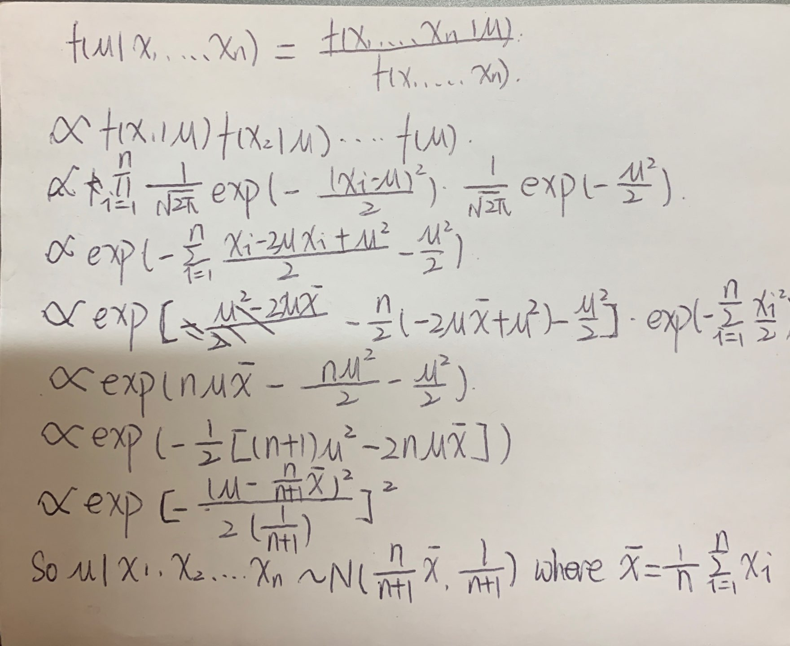
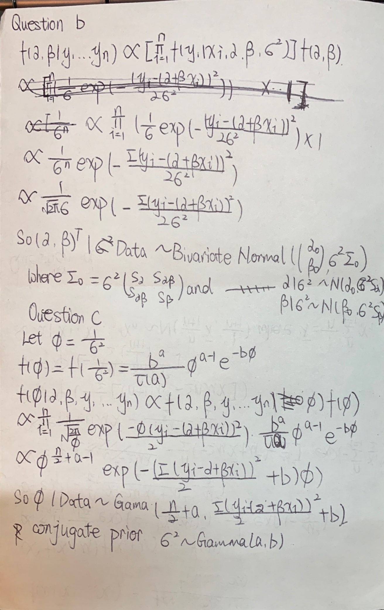
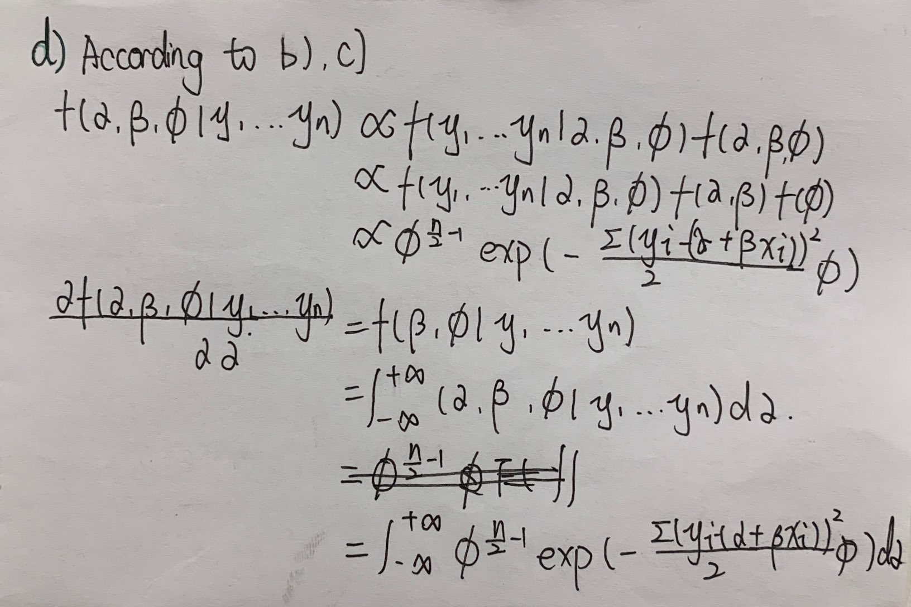

## Problem 1

### Question a

To calculate a sample size, we need additional information including:

1) The dependent variable is approximately normally distributed within each group.

2) The data is collected from a representative, randomly selected portion of the total population.

3) Sample sizes of two groups.

### Question b

If we assume sample size of two groups are the same and assumption 1) and 2) are valid. As $t = \frac{d}{var\times\sqrt{\frac{2}{n}}}$
In order to have 5% significance, $t>t_{1-\frac{2}{\alpha},2n-2}$

```{r}
d = 10
var = 20
n = 2
t = d/(var*sqrt(2/n))
while (t<=qt(0.975, 2*n-2)) {
  n = n+1
  t = d/(var*sqrt(2/n))
}
n
```

The sample size is 32.

## Problem 2

### Question a

```{r}
14*pbinom(0, 14, 0.05) + 34*(1-pbinom(0, 14, 0.05))
```

The expected value of the sample size is around 24.25.

### Question b

Let $R_i$ be the number of responses in the first or second stages, where $i \in\{1,2\}$.

The probability of a "go" decision is
$$\begin{split}
P_b&=\sum_{j=1}^4[P(R_1+R_2\geq4)]+P(R_1>4) \\
&=\sum_{j=1}^4[P(R_2>3-j,R_1=j)]+P(R_1>4) \\
&=\sum_{j=1}^4[P(R_2>3-j)P(R_1=j)]+P(R_1>4)
\end{split}$$.

```{r}
pbinom(2, 20, 0.05, lower.tail = FALSE)*dbinom(1, 14, 0.05) + pbinom(1, 20, 0.05, lower.tail = FALSE)*dbinom(2, 14, 0.05) + pbinom(0, 20, 0.05, lower.tail = FALSE)*dbinom(3, 14, 0.05) + pbinom(3, 14, 0.05, lower.tail = FALSE)
```

So the probability of a "go" decision is around 0.080.

### Question c

```{r}
pbinom(2, 20, 0.2, lower.tail = FALSE)*dbinom(1, 14, 0.2) + pbinom(1, 20, 0.2, lower.tail = FALSE)*dbinom(2, 14, 0.2) + pbinom(0, 20, 0.2, lower.tail = FALSE)*dbinom(3, 14, 0.2) + pbinom(3, 14, 0.2, lower.tail = FALSE)
```

When the true response rate is 20%, the probability of a "go" decision is around 0.904.

### Question d

Let $n$ be the sample size of the fixed design, $R$ be the number of response in the trial, if there is at least $x$ response, then the treatment is deemed promising ("go")

$$type \ I \ error = P(reject \ null|null \ is \ true) = P(R>X|p=0.05)$$
$$power = P(reject \ null|alternative \ is \ true) = P(R>X|p=0.2)$$

```{r}
n = 3
x = 1
while(pbinom(x-1,n,0.05,lower.tail = FALSE)>0.080 | pbinom(x-1,n,0.2,lower.tail = FALSE)<0.904){
  if(x<n-1){
    x = x+1
  } else {
    x = 1
    n = n+1}
}
n
```

The sample size required for a fixed design with null response 5% and alternative response 20% is 32.

## Problem 3

### Question a

Assume, $\lambda\sim\Gamma(\alpha,\beta), f(\lambda|\alpha,\beta) = \frac{\beta^{\alpha}\lambda^{\alpha-1}e^{-\beta\lambda}}{\Gamma(\alpha)}$, for $\lambda>0$.

$$\begin{split}
f(x)&=\int_0^{+\infty}f(x|\lambda)f(\lambda)d\lambda\\
&=\int_0^{+\infty}\lambda e^{-\lambda x}\frac{\beta^\alpha\lambda^{\alpha-1}e^{-\beta\lambda}}{\Gamma(\alpha)}d\lambda\\
&=\int_0^{+\infty}\frac{\lambda^\alpha\beta^\alpha e^{-(\beta+x)\lambda}}{\Gamma(\alpha)}d\lambda\\
&=\int_0^{+\infty}\frac{\lambda^{(\alpha+1)-1}(\beta+x)^{\alpha+1}e^{-(\beta+x)\lambda}}{\Gamma(\alpha+1)}\frac{\beta^\alpha(\alpha+1)}{(\beta+x)^{\alpha+1}}d\lambda\\
&=\frac{\beta^\alpha(\alpha+1)}{(\beta+x)^{\alpha+1}}
\end{split}$$

Posterior Distribution:

$$\begin{split}
f(\lambda|x)&=\frac{f(x_1|\lambda)f(\lambda)}{f(x_1)}\\
&=\frac{\lambda e^{-\lambda x_1}\frac{\beta^\alpha \lambda^{\alpha-1}e^{-\beta\lambda}}{\Gamma(\alpha)}}{\frac{\beta^\alpha(\alpha+1)}{(\beta+x_1)^{\alpha+1}}}\\
&=\frac{\lambda e^{-\lambda x_1}\lambda^{\alpha-1}e^{-\beta\lambda}(\beta+x_1)^{\alpha+1}}{\Gamma(\alpha+1)}\\
&=\frac{e^{-\lambda(x_1+\beta)}\lambda^\alpha(\beta+x_1)^{\alpha+1}}{\Gamma(\alpha+1)}\\
&=\Gamma(\alpha+1,\beta+x)
\end{split}$$

### Question b

$$\begin{split}
f(x_2|x_1)&=\frac{f(x_1,x_2)}{f(x_1)}=\frac{\int_0^{+\infty}f(x_1|\lambda)f(x_2|\lambda)f(\lambda)d\lambda}{f(x_1)}\\
&=\frac{\int_0^{+\infty}\lambda e^{-\lambda x_1}\lambda e^{-\lambda x_2}\frac{\beta^\alpha\lambda^{\alpha-1}e^{-\beta\lambda}}{\Gamma(\alpha)}d\lambda}{\frac{\beta^\alpha(\alpha+1)}{(\beta+x_1)^{\alpha+1}}}\\
&=\int_0^{+\infty}\frac{\lambda^{\alpha+1}e^{-\lambda(x_1+x_2+\beta)}(\beta+x_1)^{\alpha+1}}{\Gamma(\alpha+1)}d\lambda\\
&=\int_0^{+\infty}\frac{\lambda^{\alpha+1}e^{-\lambda(x_1+x_2+\beta)}(\beta+x_1+x_2)^{\alpha+2}}{\Gamma(\alpha+2)}\frac{(\beta+x_1)^{\alpha+1}(\alpha+2)}{(\beta+x_1+x_2)^{\alpha+2}}d\lambda\\
&=\frac{(\beta+x_1)^{\alpha+1}(\alpha+2)}{(\beta+x_1+x_2)^{\alpha+2}}
\end{split}$$

### Question c

$$\left\{
\begin{aligned}
Y_1 & = \frac{X_1+X_2}{2} \\
Y_2 & = X_1 \\
\end{aligned}
\right.$$

$$J = \left| \begin{array} {cc}
\frac{\partial Y_1}{\partial X_1} & \frac{\partial Y_1}{\partial X_2}\\
\frac{\partial Y_2}{\partial X_1} & \frac{\partial Y_2}{\partial X_2}\\
\end{array} \right | =
\left| \begin{array} {cc}
1/2 & 1/2\\
1 & 0\\
\end{array} \right | = -1/2$$

$$\begin{split}
f(\frac{x_1+x_2}{2}|x_1)&= \frac{f(\frac{x_1+x_2}{2},x_1)}{f(x_1)}=\frac{f(y_1,y_2)}{f(x_1)} = -\frac{f(x_1,x_2)}{2f(x_1)}\\
&= -\frac{(\beta+x_1)^{\alpha+1}(\alpha+2)}{2(\beta+x_1+x_2)^{\alpha+2}}
\end{split}$$

## Problem 4

Dose level 1 is safe:

1.number of DLT equals to 0 or

2.number of DLT equals to 1 and numbers of DLT equals to 0 for another 3 patients at same level. 

```{r}
dbinom(0,3,0.25)+dbinom(1,3,0.25)*dbinom(0,3,0.25)
```

The probaility that the 3+3 algorithm declare dose level 1 is safe is 0.600.

## Problem 5

### Question a

Dose 1:
0.007 0.135 0.772 < 0.02 1/3 |
0.444 0.287 0.347 < 0.02 0/3

Dose 2:
0.777 0.604 0.025 < 0.04 1/3 |
0.584 0.715 0.110 < 0.04 0/3

Dose 3:
0.770 0.405 0.742 < 0.1 0/3

Dose 4:
0.923 0.591 0.567 < 0.25 0/3

Dose 5:
0.952 0.039 0.342 < 0.5 2/3

MTD = 4

### Question b

*   Trial 1 

Dose 1:
0.534 0.342 0.661 < 0.02 0/3 

Dose 2:
0.829 0.489 0.710 < 0.04 0/3 

Dose 3:
0.921 0.055 0.497 < 0.1 1/3 |
0.611 0.118 0.122 < 0.1 0/3

Dose 4:
0.472 0.853 0.931 < 0.25 0/3

Dose 5:
0.978 0.232 0.519 < 0.5 1/3 |
0.333 0.096 0.709 < 0.5 2/3 

MTD = 4

*   Trial 2 

Dose 1:
0.985 0.844 0.948 < 0.02 0/3

Dose 2:
0.361 0.061 0.541 < 0.04 0/3

Dose 3:
0.815 0.153 0.177 < 0.1 0/3

Dose 4:
0.495 0.735 0.872 < 0.25 0/3

Dose 5:
0.799 0.028 0.555 < 0.5 1/3 |
0.763 0.752 0.682 < 0.5 0/3

MTD = 5

*   Trial 3

Dose 1:
0.228 0.586 0.732 < 0.01 0/3

Dose 2:
0.014 0.753 0.412 < 0.04 1/3 |
0.765 0.176 0.919 < 0.04 0/3

Dose 3:
0.207 0.874 0.178 < 0.1 0/3

Dose 4:
0.820 0.783 0.231 < 0.25 1/3 |
0.541 0.925 0.207 < 0.25 1/3

MTD = 3

*   Trial 4 

Dose 1:
0.408 0.808 0.434 < 0.02 0/3

Does 2:
0.008 0.382 0.166 < 0.04 1/3 |
0.328 0.294 0.635 < 0.04 0/3

Dose 3:
0.672 0.669 0.460 < 0.1 0/3

Dose 4:
0.174 0.374 0.381 < 0.25 1/3 |
0.600 0.397 0.091 < 0.25 1/3

MTD = 3

*   Trial 5  

Dose 1:
0.922 0.872 0.754 < 0.02 0/3

Dose 2:
0.520 0.977 0.748 <0.04 0/3

Dose 3:
0.955 0.978 0.531 < 0.1 0/3

Dose 4:
0.196 0.963 0.356 <0.25 1/3 |
0.061 0.795 0.823 < 0.25 1/3

MTD = 3

*   Trial 6  

Dose 1:
0.731 0.284 0.929 <0.02 0/3

Dose 2:
0.687 0.858 0.439 <0.04 0/3

Dose 3:
0.944 0.676 0.189 < 0.1 0/3

Dose 4:
0.755 0.421 0.357 <0.25 0/3

Dose 5:
0.391 0.370 0.028 <0.5 3/3

MTD = 4

*   Trial 7  

Dose 1:
0.866 0.069 0.818 < 0.02 0/3

Dose 2:
0.888 0.381 0.989 < 0.04 0/3

Dose 3:
0.663 0.491 0.285 < 0.1 0/3

Dose 4:
0.000 0.652 0.341 < 0.25 1/3 |
0.316 0.599 0.977 < 0.25 0/3

Dose 5:
0.332 0.985 0.976 < 0.5 1/3 |
0.695 0.730 0.580 < 0.5 0/3

MTD = 5

*   Trial 8  

Dose 1:
0.562 0.674 0.435 < 0.02 0/3

Dose 2:
0.747 0.521 0.024 < 0.04 1/3 |
0.412 0.719 0.819 <0.04 0/3

Dose 3:
0.139 0.278 0.270 < 0.1 0/3

Dose 4:
0.877 0.431 0.867 < 0.25 0/3

Dose 5:
0.723 0.919 0.244 <0.5 1/3 |
0.362 0.442 0.196 <0.5 3/3

MTD = 4

*   Trial 9  

Dose 1:
0.409 0.752 0.351 <0.02 0/3

Dose 2:
0.979 0.189 0.523 <0.04 0/3

Dose 3:
0.332 0.690 0.061 <0.1 1/3 |
0.552 0.253 0.450 <0.1 0/3

Dose 4:
0.403 0.592 0.381 <0.25 0/3

Dose 5:

0.673 0.182 0.862 <0.5 1/3 |
0.223 0.090 0.729 <0.5 2/3

MTD = 4

*   Trial 10  

Dose 1
0.091 0.315 0.763 <0.02 0/3

Dose 2
0.373 0.174 0.927 < 0.04 0/3

Dose 3
0.264 0.799 0.653 <0.1 0/3

Dose 4
0.569 0.109 0.706 <0.25 1/3 |
0.858 0.357 0.950 <0.25 0/3

Dose 5
0.801 0.123 0.019 <0.5 2/3

MTD = 4

```{r}
data.frame(Dose = 0:5, probability = c(0,0,0,3,5,2)/10)
```

## Problem 6

```{r}
library(dfcrm)
target = 0.1
prior = c(0.05, 0.12, 0.25, 0.40, 0.55)
trueP = c(0.02, 0.04, 0.10, 0.25, 0.50)
N = 20
crmoutput = crmsim(trueP, prior, target, N, 3, model = "logistic")
crmoutput$MTD
```

## Problem 7

```{r}
crmoutput = crmsim(trueP, prior, target, N, 3, nsim = 10, model = "logistic")
data.frame(dose = 1：5, probability = crmoutput$MTD)
```

## Problem 8

Assume $\lambda_1 \sim \Gamma(\alpha_1,\beta_1)$, $\lambda_2 \sim \Gamma(\alpha_2,\beta_2)$

$$Pr(\lambda_1>\lambda_2|x_1,...,x_n,y_1,...,y_m)=Pr((\lambda_1|x_1,...,x_n)>(\lambda_2|y_1,...,y_m))$$ where $$\lambda_1|x_1,...,x_n \sim \Gamma(\alpha_1+n, \beta_1+\sum_{i=1}^nx_i), \lambda_2|y_1,...,y_m~\Gamma(\alpha_2+m,\beta_2+\sum_{j=1}^my_j)$$

Given $\alpha_1, \alpha_2, \beta_1, \beta_2, n, m, \sum_{i=1}^nx_i, \sum_{j=1}^my_j$, we can simulate 1000 $\lambda_1$ and $\lambda_2$ and calculate $Pr(\lambda_1>\lambda_2|x_1,...,x_n,y_1,...,y_m)$.

$Pr(\lambda_1>\lambda_2|x_1,...,x_n,y_1,...,y_m)=\int_0^\infty\int_0^{\lambda_1}\Gamma(\alpha_1+n, \beta_1+\sum_{i=1}^nx_i)\Gamma(\alpha_2+m,\beta_2+\sum_{j=1}^my_j)d\lambda_2d\lambda_1$

## Problem 9

### Question a



### Question b

According to Question a, $v|y_1,...,y_m \sim N(\frac{m}{m+1}\bar y,\frac{1}{m+1})$ where $\bar y = \frac{1}{n}\sum_{i=1}^ny_i$

As $x_i$ and $y_i$ are independent

$Pr(\mu>v|x_1, ...,x_n, y_1, ...,y_m)=\int_{-\infty}^{+\infty}\int_{-\infty}^\mu f(\mu,v|x_1, ...,x_n, y_1, ...,y_m)=\int_{-\infty}^{+\infty}\int_{-\infty}^\mu f(\mu|x_1,...,x_m)f(v|y_1,...,y_m)=\int_{-\infty}^{+\infty}\int_{-\infty}^\mu\frac{1}{\sqrt{\frac{4\pi^2}{(n+1)(m+1)}}}exp(-\frac{(\mu-\frac{n}{n+1}\bar x)^2}{\frac{2}{n+1}}-\frac{v-\frac{m}{m+1}\bar y)^2}{\frac{2}{m+1}})dvd\mu$

## Problem 10

### Question a

$$L(\alpha,\beta,\sigma^2|x_i,y_i,i = 1,2,...,n)=\prod_{i=1}^n\frac{1}{\sqrt{2\pi\sigma^2}}e^{-\frac{(y_i-(\alpha+\beta x_i))^2}{2\sigma^2}}$$

$$l(\alpha,\beta,\sigma^2|x_i,y_i,i = 1,2,...,n)=-\frac{n}{2}log(2\pi)-nlog\sigma-\frac{1}{2\sigma^2}\sum_{i=1}^n(y_i-(\alpha+\beta x_i))^2$$

$$\hat\beta=\frac{\sum_{i=1}^n(x_i-\bar x)(y_i-\bar y)}{\sum_{i=1}^n(x_i-\bar x)^2}$$

$$\hat\alpha=\bar y-\hat\beta\bar x$$

$$\hat\sigma^2=\frac{1}{n}\sum_{i=1}^n(y_i-(\hat\alpha+\hat\beta x_i))^2$$





## Problem 11

### Question a

```{r}
assign_Trt = function(pA = 0.2, pB = 0.8) {
  Treatment = rep(NA,4)
  Treatment[1] = rbinom(1,1,0.5) # 0 for A, 1 for B
  for (i in 2:4) {
    if(Treatment[i-1]==0)
      rep = rbinom(1,1,pA)
    else
      rep = rbinom(1,1,pB)
    if(rep==1)
      Treatment[i] = Treatment[i-1]
    else
      Treatment[i] = 1-Treatment[i-1]
  }
  return(Treatment)
}
```

```{r}
N = 10000
B_distr = rep(NA,N)
for (i in 1:N) {
  B_distr[i] = sum(assign_Trt())
}
hist(B_distr)
data.frame(Times = c(0,1,2,3,4), Freq = c(length(B_distr[B_distr==0])/N, length(B_distr[B_distr==1])/N, length(B_distr[B_distr==2])/N, length(B_distr[B_distr==3])/N, length(B_distr[B_distr==4])/N))
```

Compared to a balanced design, the probability of more patients being assigned to treatment B is higher.

### Question b

```{r}
N = 10000
B_distr = rep(NA,N)
for (i in 1:N) {
  B_distr[i] = sum(assign_Trt(pA=0.3, pB=0.3))
}
hist(B_distr)
data.frame(Times = c(0,1,2,3,4), Freq = c(length(B_distr[B_distr==0])/N, length(B_distr[B_distr==1])/N, length(B_distr[B_distr==2])/N, length(B_distr[B_distr==3])/N, length(B_distr[B_distr==4])/N))
```

Compared to a balanced design, the probabilities of 0, 1, 3 or 4 patients being assigned to treatment B are higher.

## Problem 12

### Question a

```{r}
assign_Trt2 = function(pA = 0.2, pB = 0.8) {
  Treatment = rep(NA,4)
  nA = 1 # numbers of A ball
  nB = 1 
  for (i in 1:4) {
    Treatment[i] = rbinom(1,1,nB/(nA+nB)) # 0 for A, 1 for B
    if(Treatment[i]==0){
      rep = rbinom(1,1,pA)
      if(rep==1)
        nA = nA+1
      else
        nB = nB+1
    }
    else{
      rep = rbinom(1,1,pB)
      if(rep==1)
        nB = nB+1
      else
        nA = nA+1
    }
  }
  return(Treatment)
}
```

```{r}
N = 10000
B_distr = rep(NA,N)
for (i in 1:N) {
  B_distr[i] = sum(assign_Trt2())
}
hist(B_distr)
data.frame(Times = c(0,1,2,3,4), Freq = c(length(B_distr[B_distr==0])/N, length(B_distr[B_distr==1])/N, length(B_distr[B_distr==2])/N, length(B_distr[B_distr==3])/N, length(B_distr[B_distr==4])/N))
```

Compared to a balanced design, the probability of more patients being assigned to treatment B is higher.

### Question b

```{r}
N = 10000
B_distr = rep(NA,N)
for (i in 1:N) {
  B_distr[i] = sum(assign_Trt2(pA=0.3, pB=0.3))
}
hist(B_distr)
data.frame(Times = c(0,1,2,3,4), Freq = c(length(B_distr[B_distr==0])/N, length(B_distr[B_distr==1])/N, length(B_distr[B_distr==2])/N, length(B_distr[B_distr==3])/N, length(B_distr[B_distr==4])/N))
```

Compared to a balanced design, the probabilities of 0, 1, 3 or 4 patients being assigned to treatment B are higher.

## Problem 13

### Question a

The type I error rate of the test is 0.05

### Question b

$$w_1X_1\sim N(\mu t_1w_1, w_1^2), w_2X_2\sim N(\mu t_2w_2, w_2^2)$$
$$\begin{split}
Cov(w_1X_1, w_2X_2)&=E(w_1X_1-\mu t_1w_1)(w_2X_2-\mu t_2w_2)\\
&=E(w_1X_1w_2X_2-w_2X_2\mu t_1w_1-w_1X_1\mu t_2w_2+\mu t_1w_1\mu t_2w_2)\\
&=2w_1\mu t_1w_2\mu t_2-2w_2\mu t_2w_2\mu t_1=0
\end{split}$$

$$corr(w_1X_1,w_2X_2)=0$$

$$Z = w_1X_1+w_2X_2 \sim N(\mu t_1w_1+\mu t_2w_2,I)$$

$$Z'=Z-\mu t_1w_1+\mu t_2w_2 \sim N(0,1)$$

$$\begin{split}
Pr(Z>1.96|\mu>0) &= Pr((Z-\mu t_1w_1+\mu t_2w_2)>1.96|\mu>0) \\
&= 1-\Phi(1.96-\mu t_1w_1+\mu t_2w_2)
\end{split}$$

### Question c

According to the equation of power, we can know that the smaller $\mu t_1w_1+\mu t_2w_2$, the bigger the power. So $w_1=w_2=\frac{1}{\sqrt 2}$

